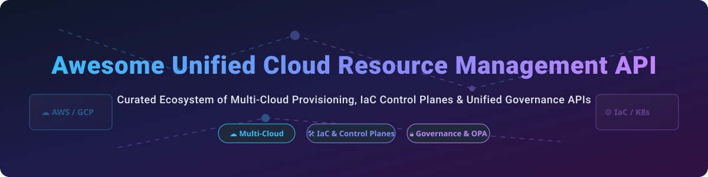

# ☁️ Awesome Unified Cloud Resource Management API 🚀

  
  
  
  

> **Curated List of Unified Cloud Resource Management Platforms, Infrastructure-as-Code (IaC) APIs & Multi-Cloud Control Planes** ⚡  
> *A comprehensive guide to SaaS control planes, open-source IaC tools, Kubernetes controllers, and cloud policy engines for platform engineers and cloud architects.* 🌐

---

## 📌 Table of Contents
- [💡 Market Overview & Ecosystem Dynamics](#-market-overview--ecosystem-dynamics)
- [🏢 SaaS & Managed Cloud Control Planes](#-saas--managed-cloud-control-planes)
- [🔓 Open-Source Cloud Infrastructure & APIs](#-open-source-cloud-infrastructure--apis)
- [🤝 How to Contribute](#-how-to-contribute)
- [⚠️ Governance & Security Disclaimer](#%EF%B8%8F-governance--security-disclaimer)
- [📈 Star History](#-star-history)
- [💖 Support & Sponsorship](#-support--sponsorship)

---

## 💡 Market Overview & Ecosystem Dynamics

> 📊 **Estimated Market Size & Structure**:  
> The global Infrastructure-as-Code (IaC) and Cloud Infrastructure Management market is estimated at **$2.5 Billion+ in 2026** (projected to exceed $5.8 Billion by 2030 at a CAGR of ~18%).  
> 🧩 **Market Fragmentation**: The sector is **moderately fragmented**. Hyper-scalers (AWS ARM, AWS CloudControl, GCP Resource Manager) command native cloud resource management, while HashiCorp (Terraform/Terraform Cloud, acquired by IBM) and Kubernetes-native abstractions (Crossplane, OpenTofu, Pulumi) lead vendor-neutral multi-cloud orchestration.

---

## 🏢 SaaS & Managed Cloud Control Planes

Below is a curated comparison of leading commercial SaaS products, enterprise management platforms, and hosted control planes, ordered by **Company Scale / Enterprise Valuation (Descending)**:

| Rank | 🏢 Platform | 💰 Starting Paid Price | 🎁 Free Tier / Trial Limit | 📊 Company Scale (Revenue / Valuation) | 🎯 Best Use Case |
| :---: | :--- | :--- | :--- | :--- | :--- |
| **1** | **[Google Cloud Resource Manager](https://cloud.google.com/resource-manager)** | $0.00 base (Pay-as-you-go for underlying GCP resources) | $300 free credits for 90 days + 20+ free tier products | **~$350B+ Revenue / ~$2.2T Valuation** (Alphabet) | Multi-project enterprise GCP hierarchy & IAM |
| **2** | **[Microsoft Azure Resource Manager (ARM)](https://azure.microsoft.com/en-us/features/resource-manager/)** | $0.00 base (Pay for underlying Azure resource usage) | $200 free credits for 30 days + 55+ always-free services | **~$245B+ Revenue / ~$3.1T Valuation** (Microsoft) | Native Azure resource management & bicep deployment |
| **3** | **[AWS Cloud Control API](https://aws.amazon.com/cloudcontrolapi/)** | $0.00 base (Standard AWS resource pricing applies) | AWS Free Tier: 750 hrs EC2, 5GB S3 monthly (12 months free) | **~$105B+ AWS Revenue / ~$2.0T Valuation** (Amazon) | Standardized CRUD API for 100+ AWS services |
| **4** | **[AWS CloudFormation](https://aws.amazon.com/cloudformation/)** | $0.00 for AWS resources ($0.0009/handler operation for 3rd-party) | 1,000 handler operations/mo free for non-AWS resources | **~$105B+ AWS Revenue / ~$2.0T Valuation** (Amazon) | AWS-native declarative infrastructure templates |
| **5** | **[Terraform Cloud](https://www.terraform.io/cloud)** | $0.00014/resource/hour (~$0.10/resource/month after free tier) | **Free Forever** for up to 500 managed resources/month | **~$500M+ ARR / $6.4B Acquisition** (HashiCorp / IBM) | Managed Terraform state, remote plan/apply & governance |
| **6** | **[Pulumi Cloud](https://www.pulumi.com/)** | $0.00025/credit (~$0.18/resource/month on Team plan) | **Free Forever** for individual developers (up to 150 resources) | **~$25M+ ARR / ~$300M+ Valuation** | Infrastructure as Code using real programming languages |
| **7** | **[Spacelift](https://spacelift.io/)** | $250/month (Starter plan) or $20,000/year enterprise | **Free Forever** (up to 2 users & 1 concurrent worker run) | **~$15M+ ARR / ~$150M+ Valuation** | Multi-IaC orchestration (Terraform, OpenTofu, Pulumi) |
| **8** | **[Scalr](https://scalr.com/)** | $99/month (Includes 500 runs/month + $0.20 per extra run) | **Free Forever** (up to 50 runs/month included) | **~$10M+ ARR / ~$80M+ Valuation** | Organizational hierarchy & Terraform cost/policy control |
| **9** | **[env0](https://www.env0.com/)** | $49/month per user (Team plan) | **14-day Free Trial** (Unlimited runs & features during trial) | **~$8M+ ARR / ~$60M+ Valuation** | Self-service cloud environments & ephemeral environment management |

---

## 🔓 Open-Source Cloud Infrastructure & APIs

Curated open-source projects, Infrastructure-as-Code engines, Kubernetes operators, and policy engines ranked by **GitHub Star Count (Descending)**:

1. **[Terraform](https://github.com/hashicorp/terraform)**   
   ⚡ **The de facto multi-cloud IaC standard** (MPL-2.0). Declarative HCL configuration covering 3,000+ cloud providers. 🛠️

2. **[OpenTofu](https://github.com/opentofu/opentofu)**   
   🔓 **Open-source community fork of Terraform** under Linux Foundation (MPL-2.0). Drop-in replacement for Terraform without BSL license restrictions. 🐧

3. **[Pulumi](https://github.com/pulumi/pulumi)**   
   💻 **Developer-first IaC platform** (Apache-2.0). Define infrastructure using TypeScript, Python, Go, Java, and C# with real programming logic. 🚀

4. **[Crossplane](https://github.com/crossplane/crossplane)**   
   ☸️ **Kubernetes-native cloud resource control plane** (CNCF Incubating, Apache-2.0). Build custom Internal Developer Platforms (IDP) and manage cloud infrastructure via K8s CRDs. 🌐

5. **[Open Policy Agent (OPA)](https://github.com/open-policy-agent/opa)**   
   🛡️ **General-purpose policy-as-code engine** (CNCF Graduated, Apache-2.0). Unified policy enforcement across cloud IaC, Kubernetes, microservices, and CI/CD pipelines. 🔑

6. **[LocalStack](https://github.com/localstack/localstack)**   
   🧪 **Fully functional local AWS cloud stack** (Apache-2.0). Run your AWS applications offline and test cloud resource scripts locally without AWS charges. 💻

7. **[AWS CDK](https://github.com/aws/aws-cdk)**   
   🏗️ **AWS Cloud Development Kit** (Apache-2.0). Define cloud infrastructure using familiar programming languages which synthesize into CloudFormation templates. ☁️

8. **[Terragrunt](https://github.com/gruntwork-io/terragrunt)**   
   📦 **Thin DRY wrapper for Terraform/OpenTofu** (MIT). Keep your configurations modular, orchestrate multi-environment deployments, and manage remote state backends. ⚙️

9. **[Atlantis](https://github.com/runatlantis/atlantis)**   
   🤖 **Terraform pull request automation server** (Apache-2.0). Execute `terraform plan` and `terraform apply` directly via Git pull request comments. 🐙

10. **[Serverless Framework](https://github.com/serverless/serverless)**   
    ⚡ **Zero-friction serverless application framework** (MIT). Deploy serverless architectures (AWS Lambda, API Gateway) across major cloud providers effortlessly. 💥

11. **[Steampipe](https://github.com/turbot/steampipe)**   
    🔍 **Zero-ETL cloud API querying with SQL** (AGPL-3.0). Query AWS, Azure, GCP, Kubernetes, and GitHub resources using standard SQL syntax. 📊

12. **[Kyverno](https://github.com/kyverno/kyverno)**   
    🔒 **Kubernetes-native policy management engine** (Apache-2.0). Validate, mutate, and generate Kubernetes resources using declarative YAML policies. 📜

13. **[CloudQuery](https://github.com/cloudquery/cloudquery)**   
    📂 **Open-source high-performance cloud asset inventory framework** (MPL-2.0). Extract, transform, and load cloud infrastructure configurations into SQL databases. 🗄️

14. **[Cloud Custodian](https://github.com/cloud-custodian/cloud-custodian)**   
    🛡️ **Stateless rules engine for cloud governance & cost management** (Apache-2.0). Real-time policy enforcement for AWS, Azure, and GCP resources. ⚖️

15. **[Gatekeeper](https://github.com/open-policy-agent/gatekeeper)**   
    🚪 **OPA-based admission controller for Kubernetes** (Apache-2.0). Enforce custom CRD-based policies and audit cluster state against compliance rules. 🗝️

16. **[Checkov](https://github.com/bridgecrewio/checkov)**   
    🔍 **Static code analysis tool for IaC security scanning** (Apache-2.0). Detect security misconfigurations in Terraform, CloudFormation, Kubernetes, and ARM. 🚨

17. **[Infracost](https://github.com/infracost/infracost)**   
    💵 **Cloud cost estimates for Terraform in pull requests** (Apache-2.0). Shift cost visibility left by showing cost impacts before applying infrastructure changes. 💸

18. **[Terrascan](https://github.com/tenable/terrascan)**   
    🛡️ **Static code analyzer for IaC security misconfigurations** (Apache-2.0). Scan Terraform, Kubernetes, Dockerfile, and Helm charts against 500+ security policies. 🩺

19. **[AWS Controllers for Kubernetes (ACK)](https://github.com/aws-controllers-kustomize/ack)**   
    ☁️ **AWS-native Kubernetes resource controllers** (Apache-2.0). Provision and manage AWS services directly using Kubernetes custom resources. ⚙️

20. **[Azure Service Operator](https://github.com/Azure/azure-service-operator)**   
    🔷 **Azure-native Kubernetes resource controllers** (MIT). Manage Azure cloud services (Azure SQL, CosmosDB, Redis) directly from Kubernetes. 💎

---

## 🤝 How to Contribute

Contributions are welcome! Please follow these simple guidelines:

1. 🍴 **Fork the Repository**
2. 📝 **Add or Update Entries** in `README.md` keeping formatting consistent.
3. ℹ️ **Include Key Information**: Name, URL, concise description, SaaS/Open-Source status, licensing, and pricing/stars info.
4. 🚀 **Submit a Pull Request** with a brief summary of additions.

---

## ⚠️ Governance & Security Disclaimer

- 🔐 **State File Security**: Infrastructure-as-Code state files often contain sensitive plain-text secrets, connection strings, and passwords. Always use encrypted remote state backends (S3 with KMS, Azure Blob, GCS) with lock mechanisms.
- 📜 **Licensing Considerations**: Evaluate license changes (such as Terraform's BSL shift vs OpenTofu's MPL-2.0) against your enterprise compliance criteria.
- 🛡️ **Shift-Left Security**: Always integrate automated security scanning tools (Checkov, Terrascan) into your CI/CD pipelines to block misconfigured cloud resources before provisioning.

---

## 📈 Star History

---

## 💖 Support & Sponsorship

Thank you for exploring this curated repository! If this resource helped you design better cloud architectures or discover useful tools, please consider supporting the project:

- ⭐ **Star this repository** to help others find it!
- 🔀 **Fork & Share** with your team and devops community.
- ☕ **Buy me a coffee**: Support ongoing maintenance via the [GitHub Sponsor Dashboard](https://github.com/sponsors/ishandutta2007).

---
*Made with ❤️ for platform engineers, Cloud DevOps architects, and Infrastructure teams worldwide.*
